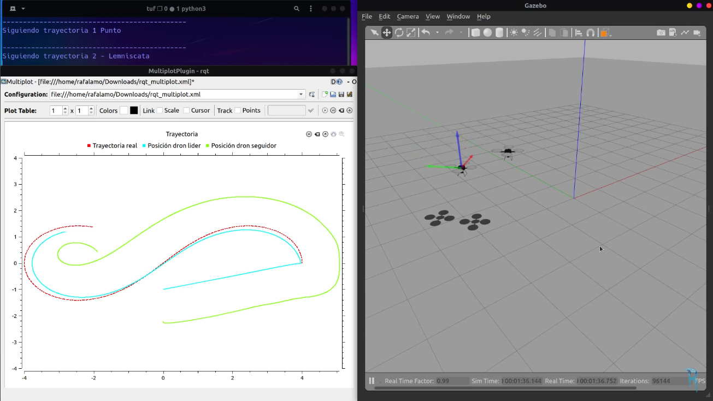

# Drones-Formation-Flying-ROS-Noetic-Hector-Quadrotor

<p align="center">
    <a href="https://www.youtube.com/watch?v=jGk-1d4ZGwg&lc=UgxA21yND3I-VqDLn9l4AaABAg"></a>
</p>

Algorithms used in my video: https://www.youtube.com/watch?v=jGk-1d4ZGwg&lc=UgxA21yND3I-VqDLn9l4AaABAg

This is just a quickly and first version, I going to inprove it later

In **drones_formation_flying_pkg** folder you have a package with the same name, and in **scripts** folder you'll find Python scripts.

**drones_follow_path.py** is the script used in my video and if you want to replicate it, you need to do the following steps:

1. You need first installed and compiled **hector-quadrotor-noetic**, you can get it in my other repo: https://github.com/RAFALAMAO/hector-quadrotor-noetic
2. Clone this repo and run catkin_make in your workspace
3. Launch two drones simulation:
```sh
  roslaunch hector_quadrotor_demo two_drones_empty.launch
```
4. Run script to follow paths
```sh
  rosrun drones_formation_flying_pkg drones_follow_path.py
```
That's it!

I added another script called **drones_just_follow** where slave drone follows leader drone, but you need to controll leader one manually, you can use the GUI of my repo https://github.com/RAFALAMAO/hector-quadrotor-noetic
